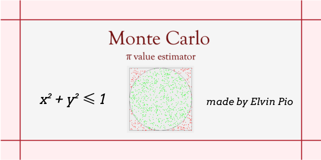

# Monte Carlo π Value Estimator


A visualization of the Monte Carlo method for estimating the value of π through random sampling.

## Overview

This project estimates π by generating random points inside a 2×2 square (with x and y ranging from -1 to 1) and determining whether each point lies inside a circle of radius 1 centered at the origin.

A point is inside the circle when:

$$
x^2 + y^2 \leq 1
$$

The area of the circle is $\pi r^2 = \pi$ (since $r = 1$), while the area of the square is $2 \times 2 = 4$. Therefore, the ratio of points inside the circle to the total number of points approaches $\pi/4$ as more samples are generated.

Rearranging gives the estimator:

$$
\pi \approx 4 \times \frac{\text{points inside circle}}{\text{total points}}
$$

As the number of random samples increases, the estimate converges closer to the actual value of π.

## How to Run

Download and run:

- `MonteCarloPi-1.0.exe` (Windows — standalone, no Java installation required)
- `MonteCarloPi.jar` (Java — requires Java 21+ installed; run with `java -jar MonteCarloPi.jar`)

The program will prompt you for a number of points to simulate, then open a window showing the simulation in action.

## Features

- Random point generation
- Real-time, animated visualization of sampled points
- Live-updating estimate of π as points are added
- Adjustable number of samples
- "Run Again" button to re-run the simulation without restarting the app
- Demonstrates statistical convergence through simulation

## Algorithm

1. Generate a random point $(x, y)$ where:

$$
-1 \leq x, y \leq 1
$$

2. Check whether the point lies inside the circle:

$$
x^2 + y^2 \leq 1
$$

3. Count the number of points inside the circle (hits).
4. Calculate the estimated value of π:

$$
\pi \approx 4 \times \frac{\text{hits}}{\text{total points}}
$$

5. Repeat the process with additional samples to improve accuracy.

## Motivation

The Monte Carlo method is a probabilistic technique that uses repeated random sampling to approximate numerical values. While it is not an efficient method for calculating π, it provides an intuitive demonstration of probability, geometry, and statistical convergence.

## Built With

- **Java (JDK 25)** — core language
- **Java Swing** — GUI window, drawing panel, animation timer, buttons, and input dialogs
- **`jpackage`** — bundled the application into a standalone native Windows installer, including its own Java runtime
- **WiX Toolset** — used internally by `jpackage` to build the Windows `.exe`/`.msi` installer

## Repository Structure

```
.
├── src/                        # Java source files
│   ├── Main.java                  # Entry point; handles user input and drives the simulation
│   ├── Point.java                 # Represents a single (x, y) coordinate
│   ├── PointGenerator.java        # Generates random points within the square
│   ├── CircleChecker.java         # Checks whether a point lies inside the circle
│   ├── MonteCarloSimulation.java  # Runs simulation trials and computes the π estimate
│   ├── SimulationPanel.java       # Custom Swing panel that draws the square, circle, and points
│   └── SimulationWindow.java      # The application window (JFrame) containing the panel, label, and button
├── build/                      # Compiled .class files
├── dist/                       # Packaged outputs (.jar, .exe installer, manifest.txt)
├── assets/                     # README images (banner, screenshots)
├── .vscode/                    # Editor configuration
└── README.md
```
